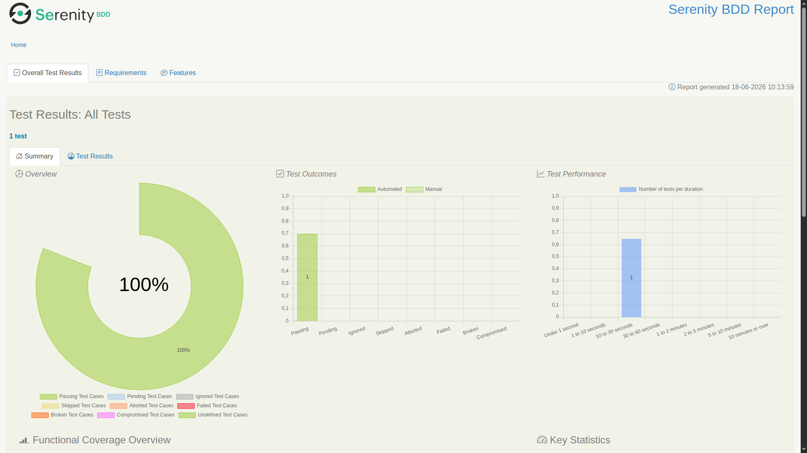
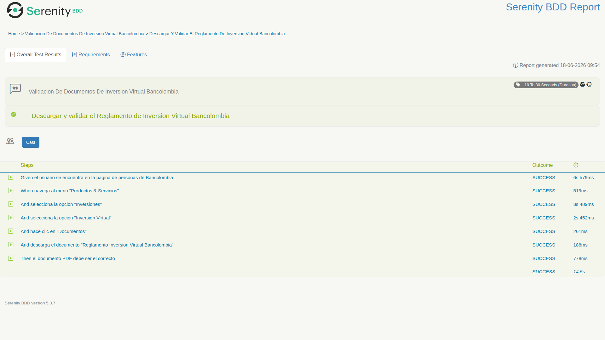
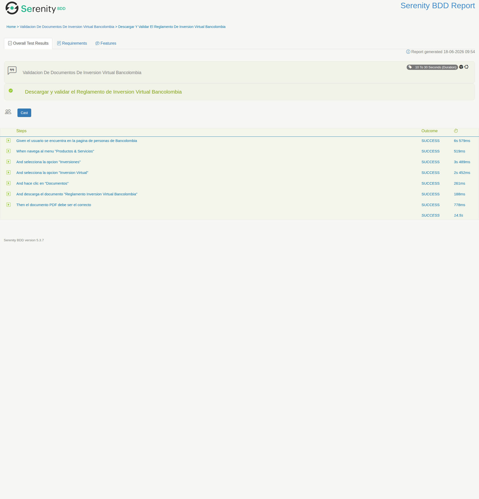

# Informe Reto Técnico de Automatización
## Skill Hacking Banistmo

---

## 1. Principales Pasos Realizados

### 1.1 Análisis y Planificación

Se analizó el sitio web [https://www.bancolombia.com/personas](https://www.bancolombia.com/personas) identificando que es un portal Liferay con componentes Vue/React que renderizan el contenido dinámicamente. Esto implica que muchos elementos del DOM no están presentes en el HTML estático y requieren interacción con JavaScript para aparecer.

**Stack tecnológico definido:**

| Tecnología | Versión | Propósito |
|---|---|---|
| Java | 17 | Lenguaje base |
| Gradle | 9.5.1 | Build tool |
| Serenity BDD | 5.3.9 | Framework de automatización con reportes |
| Cucumber | 7.34.3 | Escenarios Gherkin legibles por negocio |
| Screenplay Pattern | — | Patrón de diseño para pruebas mantenibles |
| PDFBox | 3.0.7 | Validación de PDFs |
| JUnit Platform | 5.11.4 | Ejecutor de pruebas moderno |
| Hamcrest | 3.0 | Assertions |
| SLF4J | 2.0.18 | Logging |

### 1.2 Estructura del Proyecto

```
src/test/
├── java/com/banistmo/
│   ├── constants/              # Centraliza todos los strings del proyecto
│   │   ├── Labels.java         #   Etiquetas de UI y textos de validacion
│   │   ├── Messages.java       #   Mensajes de log y error
│   │   ├── Scripts.java        #   Scripts JavaScript
│   │   ├── Selectors.java      #   Selectores CSS/XPath
│   │   └── Urls.java           #   URLs del sitio y del PDF
│   ├── interactions/           # Operaciones de bajo nivel (Screenplay Interactions)
│   │   ├── ClickAccordionByLabel.java
│   │   └── HideOverlay.java
│   ├── tasks/                  # Acciones de alto nivel (Screenplay Tasks)
│   │   ├── NavigateTo.java
│   │   ├── SelectFromMenu.java
│   │   ├── ExpandAccordion.java
│   │   └── DownloadDocument.java
│   ├── questions/              # Validaciones (Screenplay Questions)
│   │   └── ThePDF.java
│   ├── userinterfaces/         # Page Objects
│   │   └── BancolombiaPage.java
│   ├── runners/
│   │   └── CucumberTestSuite.java
│   └── stepdefinitions/
│       ├── BancolombiaSteps.java
│       └── ParameterDefinitions.java
└── resources/
    ├── features/
    │   └── bancolombia_inversiones.feature
    ├── serenity.conf
    └── junit-platform.properties
```

### 1.3 Dependencias (build.gradle)

- `serenity-core:5.3.9`, `serenity-cucumber:5.3.9`, `serenity-screenplay:5.3.9`
- `cucumber-java:7.34.3`, `cucumber-junit-platform-engine:7.34.3`
- `junit-platform-suite:1.11.4`, `junit-platform-launcher:1.11.4`
- `pdfbox:3.0.7` (uso de `Loader.loadPDF` en lugar de `PDDocument.load` — API v3)
- `hamcrest:3.0`, `slf4j-simple:2.0.18`

### 1.4 Flujo de Automatización

```gherkin
Feature: Validacion de documentos de inversion virtual Bancolombia
  Scenario: Descargar y validar el Reglamento de Inversion Virtual Bancolombia
    Given el usuario se encuentra en la pagina de personas de Bancolombia
    When navega al menu "Productos & Servicios"
    And selecciona la opcion "Inversiones"
    And selecciona la opcion "Inversion Virtual"
    And hace clic en "Documentos"
    And descarga el documento "Reglamento Inversion Virtual Bancolombia"
    Then el documento PDF debe ser el correcto
```

### 1.5 Explicación Técnica de Cada Paso

#### Paso 1: Navegar a la página de Personas
- **Tarea:** `NavigateTo` → `Open.url(Urls.PERSONAS_PAGE)`
- Usa la constante `Urls.PERSONAS_PAGE` en lugar de un string literal.

#### Paso 2: Seleccionar "Productos & Servicios"
- **Tarea:** `SelectFromMenu.menuProductosServicios()`
- Usa `JavaScriptClick.on()` para evitar el overlay (`bc-modal-overlay`).
- Referencia al botón del menú mediante `BancolombiaPage.MENU_PRODUCTOS_SERVICIOS` que usa `Selectors.MENU_PRODUCTOS_ID`.

#### Paso 3: Seleccionar "Inversiones"
- **Tarea:** `SelectFromMenu.option(Labels.INVERSIONES)`
- Se pasa el label desde la constante `Labels.INVERSIONES`.
- Mapeado en `BancolombiaSteps.NAVIGATION_ACTIONS` via Strategy Pattern.

#### Paso 4: Navegar a "Inversión Virtual"
- Mapeado en `NAVIGATION_ACTIONS` para `Labels.INVERSION_VIRTUAL`.
- Ejecuta `Open.url(Urls.INVERSION_VIRTUAL_PAGE)` + `HideOverlay.now()`.
- `HideOverlay` es una Interaction que ejecuta `Scripts.HIDE_OVERLAY`.

#### Paso 5: Hacer clic en "Documentos" (Acordeón)
- **Task:** `ExpandAccordion.documentosSection()` → delega en `ClickAccordionByLabel.withText(Labels.DOCUMENTOS)`.
- `ClickAccordionByLabel` es una Interaction que:
  1. Busca elementos visibles con el texto exacto y dispara `dispatchEvent(new MouseEvent('click'))`.
  2. Si no encuentra, busca en elementos ocultos y en componentes con clases `accordion`/`heading`.
- Los scripts JavaScript están definidos en `Scripts.java` con métodos generadores (`findVisibleAndClick`, `findAllAndClick`, `findAccordionAndClick`).

#### Paso 6: Descargar el PDF
- **Task:** `DownloadDocument.reglamentoInversionVirtual()` → `Open.url(Urls.REGLAMENTO_PDF)`.
- La URL del PDF está centralizada en `Urls.REGLAMENTO_PDF`.

#### Paso 7: Validar el PDF
- **Question:** `ThePDF.isCorrect()`.
- Flujo de validación en `ThePDF.answeredBy()`:
  1. Obtiene título y autor del PDF desde metadatos.
  2. Si el título contiene "reglamento" o el autor contiene "bancolombia" → válido.
  3. Si no, hace fallback a extracción de texto con `PDFTextStripper`.
- Las cadenas de búsqueda están en `Labels.PDF_TITLE_MARKER` y `Labels.PDF_AUTHOR_MARKER`.

### 1.6 Decisiones Técnicas Importantes

#### a) Serenity 5.3.9 + Cucumber 7
- Integración más reciente (`serenity-cucumber 5.3.9`).
- Runner con JUnit Platform (`@Suite` + `@IncludeEngines("cucumber")`) en lugar del deprecado `@RunWith(CucumberWithSerenity.class)`.

#### b) Screenplay Pattern
- **Interactions:** Operaciones de bajo nivel reutilizables (`HideOverlay`, `ClickAccordionByLabel`).
- **Tasks:** Orquestan Interactions para formar acciones de negocio (`NavigateTo`, `SelectFromMenu`).
- **Questions:** Validaciones (`ThePDF`).
- **Page Objects:** Centralizan localizadores (`BancolombiaPage`).

#### c) Principios SOLID

| Principio | Aplicación |
|---|---|
| **SRP** | Cada clase tiene una única responsabilidad. Ej: `HideOverlay` solo oculta overlays. |
| **OCP** | Step definitions usan `Map<String,Runnable>` en vez de `if/else`. Nueva opción = nueva entrada en el mapa, sin modificar el método. |
| **DIP** | Tasks/Interactions dependen de `Performable` (abstracción de Serenity), no de implementaciones concretas. |

#### d) Eliminación de Magic-Strings
Todos los strings están centralizados en `constants/`:
- **`Urls`**: URLs del sitio y del PDF
- **`Labels`**: Nombres de elementos UI y textos de validación
- **`Selectors`**: IDs, clases CSS, templates XPath con `String.format`
- **`Scripts`**: Scripts JS con `%s` placeholder, con métodos generadores
- **`Messages`**: Mensajes de log y error (formato Serenity `{0}` para el actor)

#### e) Strategy Pattern
Las step definitions (`BancolombiaSteps`) no tienen `if/else`. Cada opción del menú o elemento clickeable se mapea en un `Map<String, Runnable>`:

```java
private static final Map<String, Runnable> NAVIGATION_ACTIONS = Map.of(
        Labels.INVERSIONES,       () -> actor().attemptsTo(SelectFromMenu.option(Labels.INVERSIONES)),
        Labels.INVERSION_VIRTUAL, () -> actor().attemptsTo(
                Open.url(Urls.INVERSION_VIRTUAL_PAGE), HideOverlay.now()
        )
);
```

#### f) Manejo del Overlay
- El sitio usa `bc-modal-overlay` que bloquea interacciones normales.
- `HideOverlay` ejecuta `Scripts.HIDE_OVERLAY` via `Evaluate.javascript`.
- Para clics en el acordeón, `ClickAccordionByLabel` usa `dispatchEvent(new MouseEvent('click'))` que es lo único que activa los handlers de Vue/React.

#### g) Validación de PDF
- Se valida mediante metadatos (título + autor) con case-insensitive matching.
- El PDF está generado desde Illustrator y su texto no siempre es extraíble con PDFBox.
- Fallback a extracción de texto con `PDFTextStripper`.

#### h) Configuración de Navegador
- Chrome headless (`--headless=new`).
- Resolución 1920×1080.
- `autodownload=true`.
- `take.screenshots = FOR_FAILURES`.

---

## 2. Enlace al Repositorio

**Repositorio:** [https://github.com/jhorman10/reto_banitsmo_automatizacion](https://github.com/jhorman10/reto_banitsmo_automatizacion)

---

## 3. Comandos de Git Utilizados

```bash
# Verificar el estado inicial
git status

# Agregar archivos al staging
git add .gitignore build.gradle settings.gradle gradlew gradlew.bat gradle/ src/ README.md

# Commit inicial
git commit -m "feat: implementacion automatizacion reto Banistmo

- Serenity BDD 5.3.9 + Cucumber 7.34.3 + Screenplay
- Navegacion por menu con manejo de overlay
- Expansion de acordeon Documentos via JavaScript
- Validacion de PDF con PDFBox 3.0.7
- Runner con JUnit Platform @Suite"

# Configurar rama principal
git branch -M main

# Agregar remote y pushear
git remote add origin https://github.com/jhorman10/reto_banitsmo_automatizacion.git
git push -u origin main

# Agregar informe con URL correcta del repo
git add informe_reto_automatizacion.txt
git commit -m "fix: actualiza URL del repositorio en informe"
git push

# Agregar capturas de pantalla del reporte Serenity
git add .gitignore screenshots/ informe_reto_automatizacion.txt
git commit -m "feat: agrega capturas de pantalla del reporte Serenity"
git push

# Agregar informe en formato MD
git add INFORME.md
git commit -m "feat: agrega informe en formato .md"
git push

# Actualizar README referenciando INFORME.md
git add README.md
git commit -m "fix: actualiza README referenciando INFORME.md"
git push

# Refactor: reestructurar a arquitectura Serenity estandar + SOLID + constantes
git add -A
git commit -m "refactor: aplica principios SOLID, elimina magic-strings, arquitectura Serenity estandar"
git push

# Ver historial completo
git log --oneline

# Ver detalle de un commit
git show cefaf56 --stat
```

---

## 4. Resultados de la Ejecución

```bash
./gradlew clean test
```

**Resultado:**
- Escenario Cucumber: **PASSED**
- BUILD SUCCESSFUL en ~30s
- Reporte Serenity: `target/site/serenity/index.html`
- Reporte JUnit: `build/reports/tests/test/index.html`

### Capturas del Reporte Serenity

| Vista | Captura |
|---|---|
| Vista general del reporte |  |
| Resultado del test |  |
| Pasos del escenario |  |

---

## 5. Historial de Commits

```
cefaf56 fix: arquitectura Serenity estandar (tasks/interactions/questions/constants)
c409c5f refactor: aplica principios SOLID, Clean Architecture y elimina magic-strings
ec99603 fix: actualiza README referenciando INFORME.md
cd0d4d9 feat: agrega informe en formato .md
2171288 fix: actualiza informe con comandos git reales e historial de commits
4e45337 feat: agrega capturas de pantalla del reporte Serenity
92b66a6 fix: actualiza URL del repositorio en informe y README
1cc51a8 feat: implementacion automatizacion reto Banistmo
```

Repositorio: [https://github.com/jhorman10/reto_banitsmo_automatizacion](https://github.com/jhorman10/reto_banitsmo_automatizacion) — Rama: `main`

---

## 6. Notas Adicionales

- La URL del PDF se obtuvo inspeccionando el enlace "Conocer el reglamento" dentro del acordeón Documentos.
- El overlay (`bc-modal-overlay`) es un elemento persistente del portal Liferay que requiere ser manejado explícitamente.
- El acordeón `mlAccordion` usa event listeners de Vue/React; `dispatchEvent(new MouseEvent('click'))` es necesario porque `Selenium.click()` no activa los handlers del framework.
- PDFBox 3.0.7 cambió la API: usar `Loader.loadPDF(byte[])` en lugar del deprecado `PDDocument.load(File)`.
- Todos los strings están centralizados en el paquete `constants/` — cero magic-strings.
- Las step definitions usan `Map<String,Runnable>` (Strategy Pattern) en lugar de `if/else` — abierto a extensión, cerrado a modificación (OCP).

---

*Fin del Informe*
